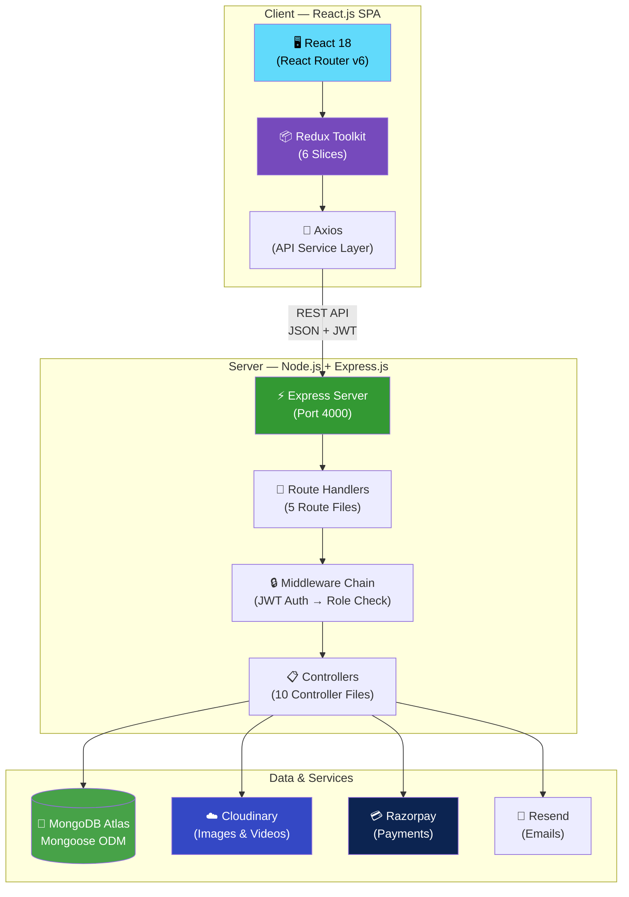
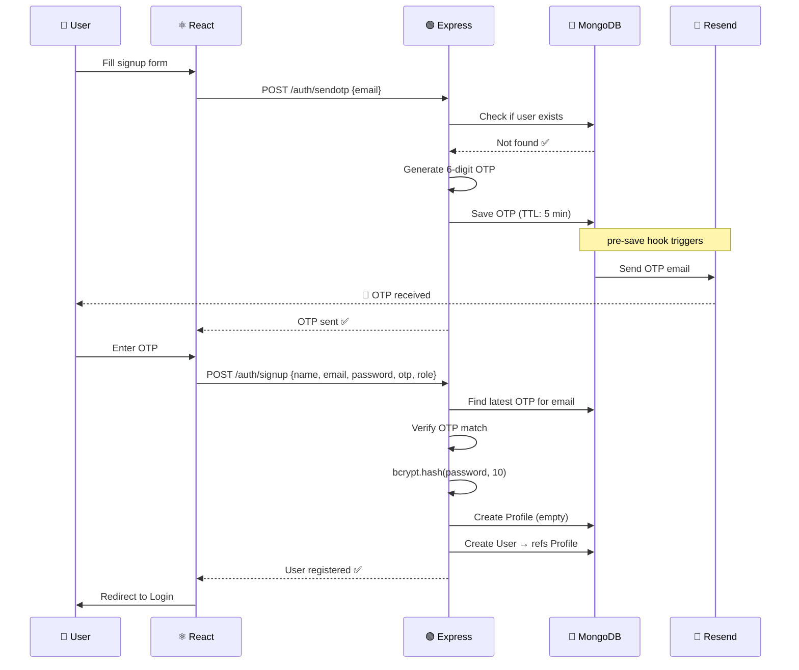
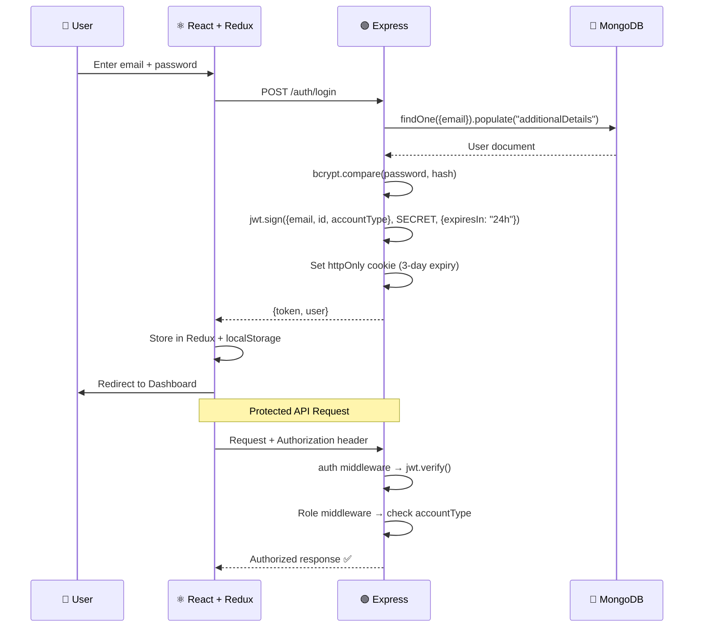
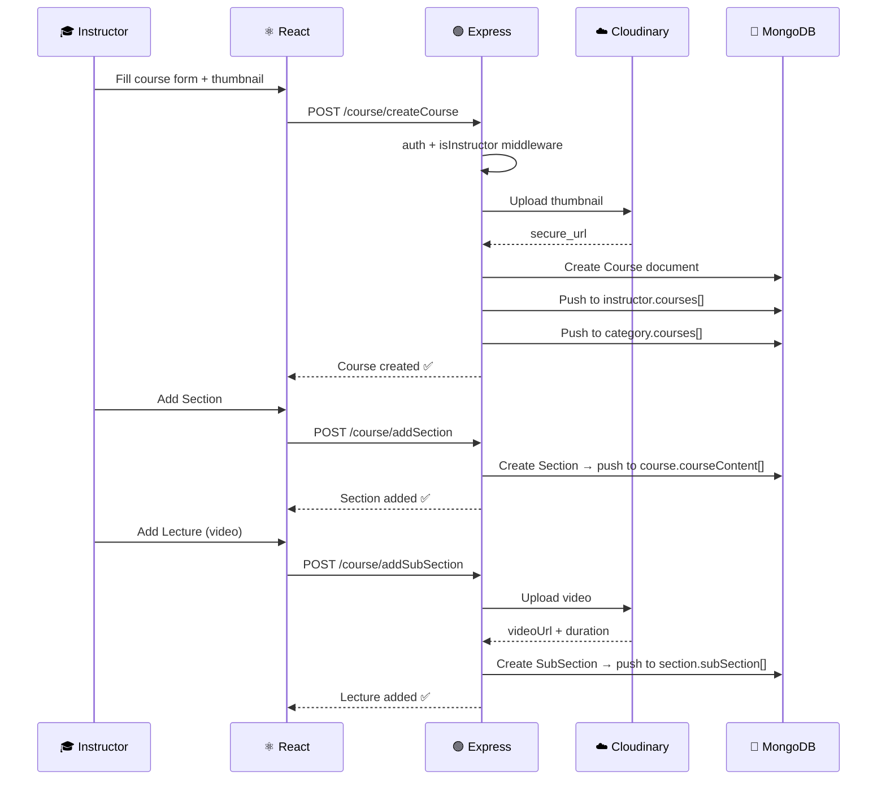
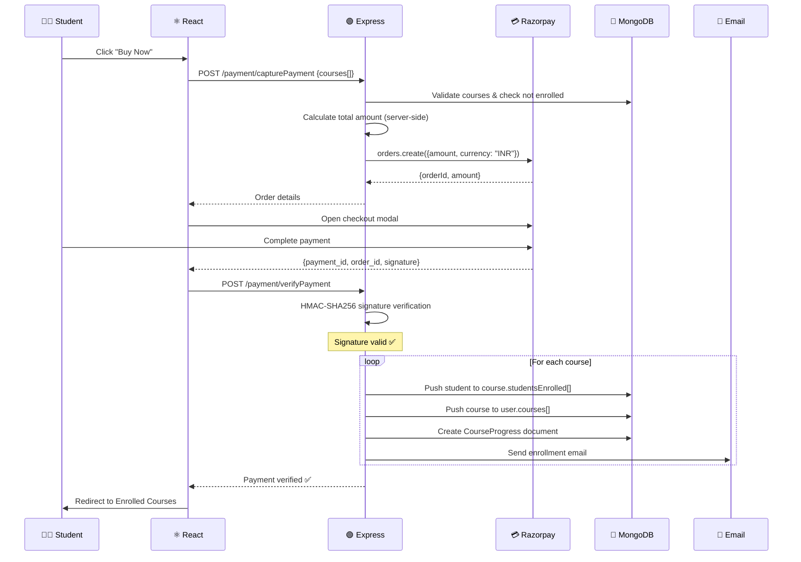
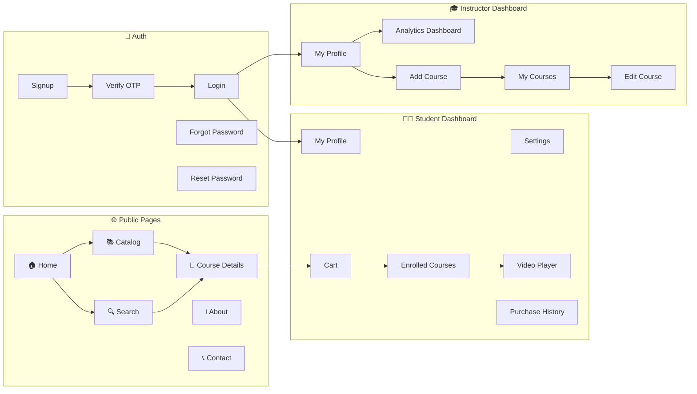
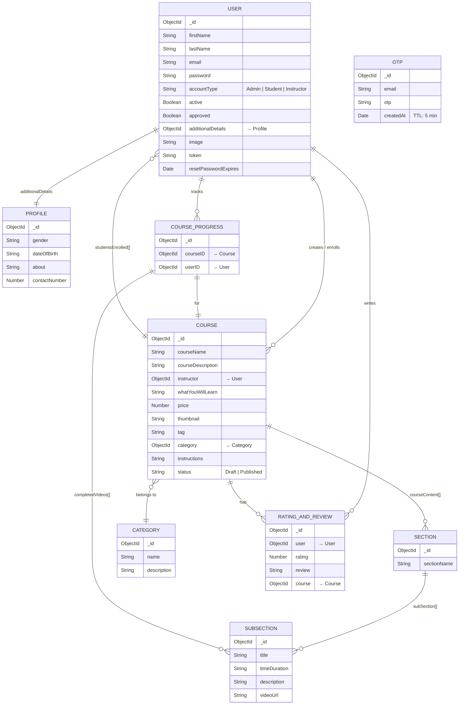

<p align="center">
  
</p>

<h1 align="center">StudyNotion — Ed-Tech Platform</h1>

<p align="center">
  A fully functional ed-tech platform built with the MERN stack that enables users to create, consume, and rate educational content.
</p>

<p align="center">
  
  
  
  
  
  
</p>

## 📖 Overview

StudyNotion is a comprehensive ed-tech platform (similar to Udemy/Coursera) where:

- **Students** can browse, search, purchase, and consume video-based courses with progress tracking
- **Instructors** can create, manage, and monetize their courses with a rich course builder
- **Admins** can manage course categories and platform settings

The platform features OTP-based email verification, Razorpay payment integration, Cloudinary media management, role-based access control, and a responsive UI — all built end-to-end using the MERN stack.

---

## ✨ Features

### For Students
| Feature | Description |
|---------|-------------|
| 🔐 **OTP Signup** | Email verification with auto-expiring OTP (5-min TTL) |
| 📚 **Browse Courses** | Explore courses by category with ratings and reviews |
| 🔍 **Search** | Find courses by name, description, or tags |
| 🛒 **Cart & Checkout** | Add to cart, purchase via Razorpay gateway |
| 🎬 **Video Player** | Watch lectures with course progress tracking |
| ⭐ **Rate & Review** | Submit ratings and reviews for enrolled courses |
| 👤 **Profile Management** | Update display picture, personal info, and password |

### For Instructors
| Feature | Description |
|---------|-------------|
| 🛠️ **Course Builder** | Create courses with Sections → Sub-sections (video upload) |
| 📊 **Dashboard** | View total students, revenue, and course analytics |
| ✏️ **Course Management** | Edit, delete, and manage Draft/Published status |
| ☁️ **Media Upload** | Upload thumbnails and videos to Cloudinary |

### For Admins
| Feature | Description |
|---------|-------------|
| 🗂️ **Category Management** | Create and manage course categories |
| 🛡️ **Admin Panel** | Platform-level administration |

---

## 📸 Demo

https://github.com/user-attachments/assets/dcdcd5a7-2026-4f09-a2f1-41dbed59756c

---

## 🏗️ Architecture

### System Architecture Diagram



### Tech Stack

| Layer | Technology | Role |
|-------|-----------|------|
| **Frontend** | React.js 18, React Router v6 | UI rendering & client-side routing |
| **Styling** | Tailwind CSS 3 | Utility-first responsive design |
| **State Management** | Redux Toolkit | Centralized app state (auth, cart, course, profile) |
| **HTTP Client** | Axios | API communication |
| **Forms** | React Hook Form | Declarative form handling & validation |
| **Backend** | Node.js 20, Express.js 4 | REST API server |
| **Database** | MongoDB Atlas, Mongoose 7 | Document database with ODM |
| **Authentication** | JWT, bcrypt | Stateless auth & password hashing |
| **Payments** | Razorpay | Course purchase & payment verification |
| **Media Storage** | Cloudinary | Image/video upload, CDN delivery |
| **Email** | Resend | OTP, password reset, enrollment emails |
| **File Upload** | express-fileupload | Multipart form handling |

### Project Structure

```
StudyNotion/
│
├── src/                          # ── React Frontend ──
│   ├── Components/
│   │   ├── common/               #   NavBar, Footer
│   │   ├── contactUs/            #   Contact form
│   │   └── core/
│   │       ├── Auth/             #   OpenRoute, PrivateRoute
│   │       ├── Dashboard/        #   MyProfile, Settings, Cart, AddCourse
│   │       ├── HomePage/         #   Landing page sections
│   │       ├── Catalog/          #   Course cards, category pages
│   │       ├── ViewCourse/       #   Video player, sidebar
│   │       └── Ratings/          #   Star ratings, reviews
│   ├── pages/                    #   14 page-level components
│   ├── services/
│   │   ├── apis.js               #   API endpoint constants
│   │   ├── apiConnector.js       #   Axios wrapper
│   │   └── operations/           #   Async API call functions
│   ├── slices/                   #   Redux slices (6 files)
│   ├── reducers/                 #   Root reducer
│   └── utils/                    #   Constants, helpers
│
├── server/                       # ── Node.js Backend ──
│   ├── index.js                  #   Express app entry point
│   ├── config/
│   │   ├── database.js           #   MongoDB connection
│   │   ├── cloudinary.js         #   Cloudinary SDK setup
│   │   └── razorpay.js           #   Razorpay instance
│   ├── models/                   #   9 Mongoose schemas
│   ├── controllers/              #   10 controller files
│   ├── routes/                   #   5 route files
│   ├── middlewares/
│   │   ├── auth.js               #   JWT verification + role guards
│   │   └── demo.js               #   Demo mode protection
│   ├── utils/
│   │   ├── mailSender.js         #   Resend email utility
│   │   ├── imageUploader.js      #   Cloudinary upload utility
│   │   └── secToDuration.js      #   Time formatting
│   └── mail/templates/           #   4 HTML email templates
│
├── package.json                  #   Frontend dependencies
├── tailwind.config.js            #   Tailwind configuration
└── .env                          #   Environment variables
```

---

## 🔄 Workflow Diagrams

### User Registration Flow (OTP-Based)



### Authentication Flow



### Course Creation Flow (Instructor)



### Payment & Enrollment Flow



### Application Navigation Map



---

## 🗄️ Database Schema

### Entity Relationship Diagram



### 9 Models at a Glance

| Model | Key Fields | Purpose |
|-------|-----------|---------|
| **User** | firstName, lastName, email, password, accountType, courses[] | User accounts with role-based access |
| **Profile** | gender, dateOfBirth, about, contactNumber | Extended user profile (referenced by User) |
| **Course** | courseName, instructor, price, status, studentsEnrolled[] | Course metadata & enrollment tracking |
| **Section** | sectionName, subSection[] | Course content grouping |
| **SubSection** | title, timeDuration, videoUrl | Individual video lectures |
| **Category** | name, description, courses[] | Course categorization |
| **RatingAndReview** | user, rating (1-5), review, course | Student course reviews |
| **CourseProgress** | courseID, userID, completedVideos[] | Per-student progress tracking |
| **OTP** | email, otp, createdAt (TTL: 5 min) | Email verification with auto-expiry |

---

## 📡 API Reference

**Base URL:** `/api/v1`

### Authentication (`/auth`)
| Method | Endpoint | Auth | Description |
|--------|----------|:----:|-------------|
| `POST` | `/auth/sendotp` | ❌ | Send OTP to email |
| `POST` | `/auth/signup` | ❌ | Register with OTP verification |
| `POST` | `/auth/login` | ❌ | Login & receive JWT |
| `POST` | `/auth/changepassword` | ✅ | Change password |
| `POST` | `/auth/reset-password-token` | ❌ | Request password reset link |
| `POST` | `/auth/reset-password` | ❌ | Reset password via token |

### Profile (`/profile`)
| Method | Endpoint | Auth | Description |
|--------|----------|:----:|-------------|
| `GET` | `/profile/getUserDetails` | ✅ | Get user profile |
| `PUT` | `/profile/updateProfile` | ✅ | Update profile info |
| `PUT` | `/profile/updateDisplayPicture` | ✅ | Upload profile picture |
| `DELETE` | `/profile/deleteProfile` | ✅ | Delete account |
| `GET` | `/profile/getEnrolledCourses` | ✅ | List enrolled courses |
| `GET` | `/profile/getInstructorDashboardDetails` | ✅ | Instructor analytics |

### Courses (`/course`)
| Method | Endpoint | Auth | Role | Description |
|--------|----------|:----:|------|-------------|
| `GET` | `/course/getAllCourses` | ❌ | — | List all courses |
| `POST` | `/course/getCourseDetails` | ❌ | — | Public course details |
| `POST` | `/course/getFullCourseDetails` | ✅ | Any | Details + progress (enrolled) |
| `POST` | `/course/createCourse` | ✅ | Instructor | Create course |
| `POST` | `/course/editCourse` | ✅ | Instructor | Edit course |
| `DELETE` | `/course/deleteCourse` | ✅ | Auth | Delete course |
| `GET` | `/course/getInstructorCourses` | ✅ | Instructor | Instructor's courses |
| `POST` | `/course/searchCourse` | ❌ | — | Search by name/desc/tag |
| `POST` | `/course/updateCourseProgress` | ✅ | Student | Mark lecture complete |

### Sections & Sub-Sections (`/course`)
| Method | Endpoint | Auth | Description |
|--------|----------|:----:|-------------|
| `POST` | `/course/addSection` | ✅ | Add section to course |
| `POST` | `/course/updateSection` | ✅ | Update section |
| `POST` | `/course/deleteSection` | ✅ | Delete section |
| `POST` | `/course/addSubSection` | ✅ | Add lecture with video |
| `POST` | `/course/updateSubSection` | ✅ | Update lecture |
| `POST` | `/course/deleteSubSection` | ✅ | Delete lecture |

### Categories (`/course`)
| Method | Endpoint | Auth | Description |
|--------|----------|:----:|-------------|
| `POST` | `/course/createCategory` | ✅ | Create category (Admin) |
| `GET` | `/course/showAllCategories` | ❌ | List all categories |
| `POST` | `/course/getCategoryPageDetails` | ❌ | Courses in a category |
| `POST` | `/course/addCourseToCategory` | ✅ | Assign course to category |

### Ratings & Reviews (`/course`)
| Method | Endpoint | Auth | Description |
|--------|----------|:----:|-------------|
| `POST` | `/course/createRating` | ✅ | Submit rating & review |
| `GET` | `/course/getAverageRating` | ❌ | Average rating for a course |
| `GET` | `/course/getReviews` | ❌ | All reviews |

### Payments (`/payment`)
| Method | Endpoint | Auth | Description |
|--------|----------|:----:|-------------|
| `POST` | `/payment/capturePayment` | ✅ | Create Razorpay order |
| `POST` | `/payment/verifyPayment` | ✅ | Verify signature & enroll |
| `POST` | `/payment/sendPaymentSuccessEmail` | ✅ | Payment confirmation email |

### Contact (`/contact`)
| Method | Endpoint | Auth | Description |
|--------|----------|:----:|-------------|
| `POST` | `/contact/contactUs` | ❌ | Submit contact form |

---

## 🚀 Getting Started

### Prerequisites

- **Node.js** v20+ — [Download](https://nodejs.org/)
- **MongoDB Atlas** account — [Free Tier](https://www.mongodb.com/atlas)
- **Cloudinary** account — [Sign Up](https://cloudinary.com/)
- **Razorpay** account — [Dashboard](https://dashboard.razorpay.com/)
- **Resend** account — [Sign Up](https://resend.com/)

### 1. Clone the Repository

```bash
git clone https://github.com/Gagan202005/StudyNotion1.git
cd StudyNotion1
```

### 2. Install Dependencies

```bash
# Install frontend dependencies
npm install

# Install backend dependencies
cd server
npm install
cd ..
```

### 3. Environment Variables

Create a `.env` file in the **root** directory:

```env
REACT_APP_BASE_URL=http://localhost:4000/api/v1
REACT_APP_RAZORPAY_KEY_ID=your_razorpay_key_id
```

Create a `.env` file in the **`server/`** directory:

```env
# Server
PORT=4000

# Database
MONGODB_URL=mongodb+srv://<username>:<password>@cluster0.xxxxx.mongodb.net/<dbname>

# JWT
JWT_SECRET=your_jwt_secret_key

# Cloudinary
CLOUD_NAME=your_cloud_name
API_KEY=your_cloudinary_api_key
API_SECRET=your_cloudinary_api_secret
FOLDER_NAME=your_cloudinary_folder

# Razorpay
RAZORPAY_KEY=your_razorpay_key
RAZORPAY_SECRET=your_razorpay_secret

# Email (Resend)
RESEND_API_KEY=your_resend_api_key
MAIL_FROM=your_verified_email@yourdomain.com

# CORS
CORS_ORIGIN=["http://localhost:3000"]

# Contact
CONTACT_MAIL=your_contact_email@gmail.com
```

### 4. Run the Application

```bash
# Run both frontend and backend concurrently
npm run dev
```

This starts:
- **Frontend** → `http://localhost:3000`
- **Backend** → `http://localhost:4000`

Or run them separately:

```bash
# Frontend only
npm start

# Backend only (from root)
npm run server
```

---

## 🌐 Deployment

| Component | Service | URL |
|-----------|---------|-----|
| **Frontend** | [Vercel](https://vercel.com) | Auto-deploys from GitHub |
| **Backend** | [Render](https://render.com) | Auto-deploys from GitHub |
| **Database** | [MongoDB Atlas](https://www.mongodb.com/atlas) | Managed cloud cluster |
| **Media** | [Cloudinary](https://cloudinary.com) | CDN-backed media storage |

### Deployment Steps

1. **Frontend (Vercel):**
   - Import GitHub repo → set `REACT_APP_BASE_URL` to your Render backend URL → Deploy

2. **Backend (Render):**
   - Create Web Service → connect GitHub → set all `server/.env` variables → Deploy

3. **Database (MongoDB Atlas):**
   - Create free cluster → whitelist Render's IPs → copy connection string to `MONGODB_URL`

4. **Cloudinary:**
   - Create account → copy Cloud Name, API Key, API Secret to env vars

---

## 🔧 Environment Variables Reference

| Variable | Location | Description |
|----------|----------|-------------|
| `REACT_APP_BASE_URL` | Root `.env` | Backend API base URL |
| `REACT_APP_RAZORPAY_KEY_ID` | Root `.env` | Razorpay public key (for checkout) |
| `PORT` | Server `.env` | Backend server port |
| `MONGODB_URL` | Server `.env` | MongoDB Atlas connection string |
| `JWT_SECRET` | Server `.env` | Secret key for JWT signing |
| `CLOUD_NAME` | Server `.env` | Cloudinary cloud name |
| `API_KEY` | Server `.env` | Cloudinary API key |
| `API_SECRET` | Server `.env` | Cloudinary API secret |
| `FOLDER_NAME` | Server `.env` | Cloudinary upload folder |
| `RAZORPAY_KEY` | Server `.env` | Razorpay key ID |
| `RAZORPAY_SECRET` | Server `.env` | Razorpay key secret |
| `RESEND_API_KEY` | Server `.env` | Resend API key |
| `MAIL_FROM` | Server `.env` | Verified sender email (Resend) |
| `CORS_ORIGIN` | Server `.env` | Allowed origins (JSON array) |
| `CONTACT_MAIL` | Server `.env` | Contact form recipient |

---

## 📬 Email Templates

The platform sends transactional emails using custom HTML templates:

| Template | Trigger | Content |
|----------|---------|---------|
| **Email Verification** | User signup | OTP code for email verification |
| **Password Update** | Password changed/reset | Confirmation of password change |
| **Course Enrollment** | Successful purchase | Course name, description, thumbnail |
| **Payment Success** | Payment verified | Amount, payment ID, order ID |

---

## 🛡️ Security Features

- **Password Hashing** — bcrypt with 10 salt rounds
- **JWT Authentication** — 24-hour token expiry with httpOnly cookies
- **OTP Auto-Expiry** — MongoDB TTL index (5 minutes)
- **CORS Whitelist** — Configurable allowed origins
- **Role-Based Authorization** — Middleware guards for Student / Instructor / Admin
- **Payment Verification** — HMAC-SHA256 signature validation (Razorpay)
- **Server-Side Price Calculation** — Prevents client-side amount tampering

---

## 🗂️ Redux State Architecture

| Slice | State Shape | Purpose |
|-------|------------|---------|
| `authSlice` | `{ signupData, loading, token }` | Authentication & signup flow |
| `profileSlice` | `{ user, loading }` | Logged-in user data |
| `cartSlice` | `{ cart, total, totalItems }` | Shopping cart (localStorage) |
| `courseSlice` | `{ step, course, editCourse, paymentLoading }` | Course builder wizard |
| `viewCourseSlice` | `{ courseSectionData, completedLectures, totalNoOfLectures }` | Video player & progress |
| `loadingBarSlice` | `progress` | Top loading indicator |

---

## 📄 License

This project is built for educational purposes.

---

<p align="center">
  Built with ❤️ using the MERN Stack
</p>
